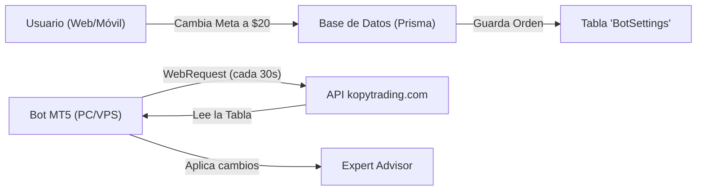

# Propuesta de Panel de Control Web - Kopytrading

Para que el panel sea **premium** y útil, lo ideal es dividir los parámetros en tres niveles de acceso. Esto evita que el cliente "toque de más" por error, pero le da el control total si lo desea.

---

## 🟢 Nivel 1: Control Maestro (Imprescindible)
Estos son los botones grandes que el usuario quiere tener a mano en su móvil.

*   **Estado del Bot**: Un interruptor ON/OFF (Pausar/Reanudar).
*   **Cierre de Emergencia**: Botón "Cerrar todo ahora y pausar".
*   **Modo de Operación**: Selector entre `ZEN` (conservador) y `COSECHA` (agresivo).
*   **Dirección**: Selector entre `SOLO BUY`, `SOLO SELL` o `AMBAS`.

---

## 🟡 Nivel 2: Gestión de Riesgo (Ajustes Rápidos)
Permite al usuario adaptar el bot a su capital o al miedo del momento.

*   **Meta Diaria ($)**: Cuánto quiere ganar hoy antes de que el bot se pare (Meta Alcanzada).
*   **Pérdida Máxima Diaria ($)**: El "seguro de vida" que cierra todo si las cosas van mal.
*   **Lote Inicial**: Para los que quieren subir el riesgo cuando tienen una buena racha.
*   **Máximo de Posiciones**: Limitar cuántas operaciones permite abiertas a la vez.

---

## 🔴 Nivel 3: Ajustes Técnicos (Modo Experto)
Esto normalmente se deja pre-configurado, pero se puede exponer en un menú "Avanzado".

*   **Velas Estructurales**: El parámetro de 5 horas que comentamos hoy (20 velas).
*   **Sensibilidad RSI**: Ajustar los niveles de sobrecompra/sobreventa.
*   **Filtro de Noticias**: Activar o desactivar el bloqueo por eventos económicos.
*   **Break Even / Trailing**: Distancias y beneficios asegurados.

---

## 🛠️ ¿Cómo se vería técnicamente?

### El "Efecto Wow" para el cliente:
Imagina que el cliente está en una cena, recibe una alerta de Telegram diciendo que el mercado está volátil, entra en tu web, le da a un botón de **"Modo Protección"** y el bot en su casa se ajusta al instante. Eso es lo que marca la diferencia entre un bot normal y una plataforma profesional.

¿Qué te parece este abanico de opciones? ¿Añadirías algo más o prefieres empezar solo con lo más básico? 🦾🚀🛡️
